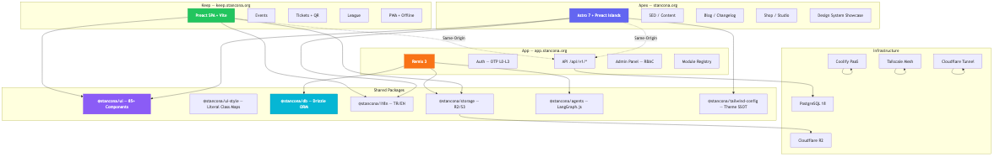
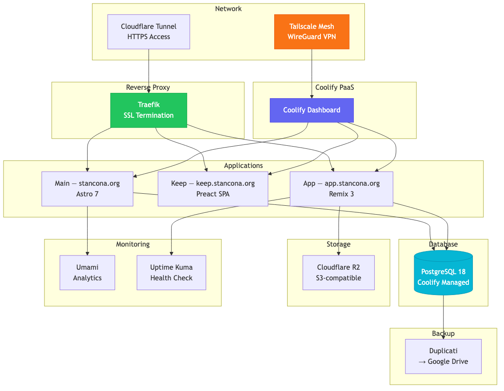
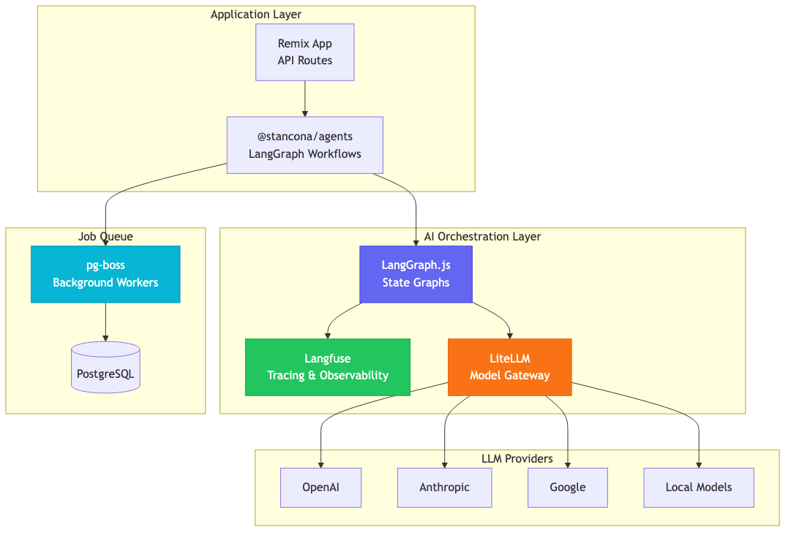

<div align="center">

# ⚔️ Stancona

**Full-Stack Web Ecosystem · TTRPG Platform**

[](https://stancona.org)

[](<>)
[](<>)
[](<>)
[](<>)

</div>

---

## Overview

Stancona is a full-stack web ecosystem built solo, designed for tabletop RPG (TTRPG) communities. It features a multi-surface architecture with 85+ design system components, a consumer PWA, and a modular admin panel.

> **Note:** This portfolio uses fictional TTRPG-themed data. No real customer information is displayed.

---

## Architecture



### Three-Tier Surface Architecture

| Surface  | Domain            | Framework        | Purpose                     |
| -------- | ----------------- | ---------------- | --------------------------- |
| **Apex** | stancona.org      | Astro 7 + Preact | SEO, content, discovery     |
| **Keep** | keep.stancona.org | Preact SPA       | Events, tickets, QR, league |
| **App**  | app.stancona.org  | Remix 3          | Auth, API, admin panel      |

All surfaces share same-origin routing with a family cookie on `.stancona.org` — no CORS required.

---

## Design System


85+ production-ready Preact components with 74 interactive showcase pages. Built on daisyUI 5 + Tailwind CSS v4.

| Category         | Components | Examples                            |
| ---------------- | ---------- | ----------------------------------- |
| **Foundations**  | 5          | Colors, theme, typography, icons    |
| **Actions**      | 6          | Button, dropdown, FAB, modal        |
| **Data Display** | 18         | Table, card, badge, stat, timeline  |
| **Navigation**   | 9          | Navbar, breadcrumb, pagination, tab |
| **Feedback**     | 6          | Alert, toast, progress, skeleton    |
| **Data Input**   | 15         | Input, select, checkbox, toggle     |
| **Layout**       | 8          | Drawer, footer, hero, divider       |
| **Mockup**       | 3          | Browser, phone, window              |


---

## Keep — Consumer PWA


A mobile-first Progressive Web App for event discovery, ticket management with QR codes, and league standings. Full offline support via IndexedDB + Workbox.

| Feature            | Status                   |
| ------------------ | ------------------------ |
| Event discovery    | ✅                       |
| Ticket + QR code   | ✅                       |
| Offline storage    | ✅ (IndexedDB + Workbox) |
| League standings   | ✅                       |
| PWA install prompt | ✅                       |
| Capacitor mobile   | 🔄 Planned               |


---

## Admin Panel


Modular monolith backend with manifest-based module system and role-based access control.

| Feature             | Details                                 |
| ------------------- | --------------------------------------- |
| **RBAC**            | 15 role types, hierarchical permissions |
| **Module System**   | Manifest-driven, dynamic shell          |
| **Command Palette** | ⌘K quick access                         |
| **API**             | `/api/v1/*`, 2-tier rate limiting       |
| **Auth**            | Email OTP (L0-L3 account ladder)        |


---

## Infrastructure



Self-hosted, cost-effective, secure infrastructure.

| Component      | Technology               | Purpose                 |
| -------------- | ------------------------ | ----------------------- |
| **PaaS**       | Coolify                  | Application management  |
| **Proxy**      | Traefik                  | SSL, routing            |
| **VPN**        | Tailscale                | Mesh networking, access |
| **Tunnel**     | Cloudflare Tunnel        | HTTPS access            |
| **Backup**     | Duplicati → Google Drive | Daily backups           |
| **Analytics**  | Umami                    | Privacy-first analytics |
| **Monitoring** | Uptime Kuma              | Service status          |

---

## AI Orchestration



| Component        | Purpose                   |
| ---------------- | ------------------------- |
| **LangGraph.js** | State graph orchestration |
| **Langfuse**     | Tracing and observability |
| **LiteLLM**      | Model gateway (multi-LLM) |
| **pg-boss**      | Background job queue      |

---

## Tech Stack

| Layer               | Technology                          |
| ------------------- | ----------------------------------- |
| **Frontend**        | Astro 7, Remix 3, Preact 10, Vite 8 |
| **Styling**         | Tailwind CSS v4, daisyUI 5          |
| **Backend**         | Remix 3 (Node.js ≥24.3)             |
| **Database**        | PostgreSQL 18, Drizzle ORM          |
| **Storage**         | Cloudflare R2 (S3-compatible)       |
| **Package Manager** | pnpm v10 (catalog)                  |
| **Monorepo**        | Turborepo                           |
| **Linter**          | Biome                               |
| **Testing**         | Playwright (E2E), Vitest (unit)     |
| **CI/CD**           | GitHub Actions                      |
| **Infrastructure**  | Coolify, Traefik, Tailscale         |

---

## By the Numbers

| Metric                        | Value                    |
| ----------------------------- | ------------------------ |
| Components                    | 85+                      |
| Showcase pages                | 74                       |
| Architecture Decision Records | 26                       |
| Applications                  | 3 (Astro, Remix, Preact) |
| Packages                      | 8 (@stancona/*)          |
| Role types                    | 15                       |
| Languages                     | 2 (TR/EN)                |
| daisyUI themes                | 10+                      |

---

## Getting Started

```bash
# Clone the main application repo
git clone https://github.com/stancona/grimoire.git
cd grimoire

# Install dependencies
pnpm install

# Run all apps
pnpm dev

# Run individual apps
pnpm dev:main     # stancona.org
pnpm dev:keep     # keep.stancona.org
pnpm dev:app      # app.stancona.org

# Run tests
pnpm test         # Unit tests
pnpm e2e          # Playwright E2E
pnpm typecheck    # TypeScript check
pnpm lint         # Biome lint
```

---

## Portfolio Structure

```
portfolio/
├── assets/              # Banners, social media images
├── screenshots/
│   ├── en/              # English screenshots
│   └── tr/              # Turkish screenshots
├── diagrams/            # Mermaid architecture diagrams
├── fixtures/            # TTRPG-themed demo data
├── scripts/             # Image processing scripts
└── docs/                # Showcase guides
```

---

## License

MIT License © 2026 Stancona

---

<div align="center">

**[stancona.org](https://stancona.org) · [GitHub](https://github.com/stancona) · [LinkedIn](https://linkedin.com/in/emin)**

</div>
